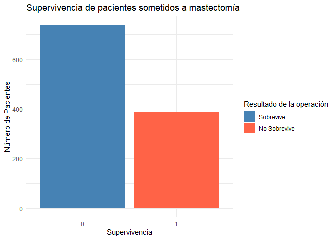

Análisis datos cáncer de mama
================
Abril García Luque, Ana León Miranda, Ana Liqing Sánchez Castellano
2024-12-16

- [Introducción](#introducción)
- [Objetivos](#objetivos)
- [Materiales y métodos](#materiales-y-métodos)
- [Análisis de los datos](#análisis-de-los-datos)
- [Conclusión](#conclusión)
- [Información de la sesión](#información-de-la-sesión)
- [Bibliografía](#bibliografía)


## Introducción

El cáncer de mama es una enfermedad en la que las células del tejido
mamario crecen de **manera descontrolada**, formando un tumor maligno.
Es el tipo de cáncer más común en mujeres. Su detección temprana,
mediante *autoexploraciones,* *mamografías* y *chequeos médicos*, mejora
significativamente las posibilidades de tratamiento exitoso.

## Objetivos

El objetivo de este proyecto es ver qué tipo de cirugía es más exitosa y
la edad media en la que se detecta este tumor maligno.

## Materiales y métodos

Las librerías y paquetes que vamos a necesitar son:

``` default
library('dplyr')
library('ggplot2')
```

Además, los datos que vamos a utilizar para hacer nuestro análisis se
encuentran en
[kaggle](https://www.kaggle.com/datasets/raghadalharbi/breast-cancer-gene-expression-profiles-metabric/data).

## Análisis de los datos

En primer lugar asignamos los datos a una variable.

``` default
mydata <- read.csv("METABRIC_RNA_Mutation.csv")
```

Lo primero que queremos observar es sobre qué edad se diagnostican más
casos de cáncer de mama.

``` default
mydata %>% ggplot(aes(x = age_at_diagnosis)) + 
  geom_density() +
  ggtitle("Gráfico edad") +
  labs(x = "Edad")
```

<figure>

<figcaption aria-hidden="true"><strong>Figura</strong>
<strong>1:</strong> Diagrama de densidad edad.</figcaption>
</figure>

Hacemos un análisis estadístico que muestre la **media**, el **máximo**
y el **mínimo** de la edad de las personas que sufren este tipo de
cáncer.

``` default
mydata %>% summarise(total_casos = n(), 
                     media = mean(age_at_diagnosis),
                     maximo = max(age_at_diagnosis),
                     minimo = min(age_at_diagnosis))
```

    ##   total_casos    media maximo minimo
    ## 1        1904 61.08705  96.29  21.93

Primero veremos cuántos pacientes han sobrevivido al haberse sometido a
una mastectomía, para ello seleccionaremos las columnas que queremos
comparar.

``` default
mydata %>% select(type_of_breast_surgery, overall_survival) %>% 
```

``` r
mydata %>% select(type_of_breast_surgery, overall_survival) %>% 
  head()
```

    ##   type_of_breast_surgery overall_survival
    ## 1             MASTECTOMY                1
    ## 2      BREAST CONSERVING                1
    ## 3             MASTECTOMY                0
    ## 4             MASTECTOMY                1
    ## 5             MASTECTOMY                0
    ## 6             MASTECTOMY                0

Después, asignaremos una variable con los datos seleccionados.

``` r
datos_selected <- mydata %>% select(type_of_breast_surgery, overall_survival)
```

Ahora, filtraremos los datos para obtener solo los casos de los
pacientes que se hayan sometido a la **mastectomía** y asignamos una
variable.

``` r
datos_selected %>% filter(type_of_breast_surgery == "MASTECTOMY") %>% head()
```

    ##   type_of_breast_surgery overall_survival
    ## 1             MASTECTOMY                1
    ## 2             MASTECTOMY                0
    ## 3             MASTECTOMY                1
    ## 4             MASTECTOMY                0
    ## 5             MASTECTOMY                0
    ## 6             MASTECTOMY                0

``` r
mastectomia <- datos_selected %>% filter(type_of_breast_surgery == "MASTECTOMY")
```

``` r
mastectomia %>%
  ggplot(aes(x = factor(overall_survival), fill = factor(overall_survival))) +
  geom_bar() +
  scale_fill_manual(values = c("steelblue", "tomato"), 
                    labels = c("Sobrevive", "No Sobrevive")) +
  labs(
    x = "Supervivencia", 
    y = "Número de Pacientes",
    title = "Supervivencia de pacientes sometidos a mastectomía",
    fill = "Resultado de la operación"
  ) +
  theme_minimal()
```

<figure>

<figcaption aria-hidden="true"><strong>Figura</strong>
<strong>2:</strong> Supervivencia pacientes sometidos a mastectomía.
0=sobreviven, 1=no sobreviven.</figcaption>
</figure>

Una vez obtenido el gráfico, analizamos el número de pacientes que
sobreviven y aquellos que no.  
**SOBREVIVEN:**

``` r
mastectomia %>% filter(type_of_breast_surgery == "MASTECTOMY") %>% 
  filter(overall_survival == 0) %>% nrow()
```

    ## [1] 738

**NO SOBREVIVEN:**

``` r
mastectomia %>% filter(type_of_breast_surgery == "MASTECTOMY") %>% 
  filter(overall_survival == 1) %>% nrow()
```

    ## [1] 389

Hacemos lo mismo, pero con *Breast conserving*. Para ver cuántos
pacientes han sobrevivido al haberse sometido a una operación en la que
**sí conservan** parte del tejido mamario seleccionaremos las columnas
que queremos comparar.  
Asignamos la variable *conservan* a los datos ya filtrados.

``` r
datos_selected %>% filter(type_of_breast_surgery == "BREAST CONSERVING") %>% head()
```

    ##   type_of_breast_surgery overall_survival
    ## 1      BREAST CONSERVING                1
    ## 2      BREAST CONSERVING                1
    ## 3      BREAST CONSERVING                0
    ## 4      BREAST CONSERVING                0
    ## 5      BREAST CONSERVING                1
    ## 6      BREAST CONSERVING                1

``` r
conservan <- datos_selected %>% filter(type_of_breast_surgery == "BREAST CONSERVING") 
```

Realizamos en gráfico para comparar la supervivencia entre los
pacientes.

``` r
conservan %>%
  ggplot(aes(x = factor(overall_survival), fill = factor(overall_survival))) +
  geom_bar() +
  scale_fill_manual(values = c("steelblue", "tomato"), 
                    labels = c("Sobrevive", "No Sobrevive")) +
  labs(
    x = "Supervivencia", 
    y = "Número de Pacientes",
    title = "Supervivencia de Pacientes que sí han conservado parte del tejido mamario ",
    fill = "Resultado de la operación"
  ) +
  theme_minimal()
```

<figure>

<figcaption aria-hidden="true"><strong>Figura</strong>
<strong>3:</strong> Supervivencia pacientes que conservan su tejido
mamario. 0=sobreviven, 1=no sobreviven.</figcaption>
</figure>

Para saber el número de pacientes que sobreviven y aquellos que no.

**SOBREVIVEN:**

``` r
conservan %>% filter(type_of_breast_surgery == "BREAST CONSERVING") %>% 
  filter(overall_survival == 0) %>% nrow()
```

    ## [1] 351

**NO SOBREVIVEN:**

``` r
conservan %>% filter(type_of_breast_surgery == "BREAST CONSERVING") %>% 
  filter(overall_survival == 1) %>% nrow()
```

    ## [1] 404

## Conclusión

En base al análisis estadístico, podemos concluir que la población que
más sufre este tipo de cáncer son las mujeres cuya edad oscila entre los
61 años. Aunque en nuestra base de datos el rango en el que es posible
encontrar pacientes que padezcan este tipo de enfermedad oscila desde
los 22 hasta los 96 años.

Finalmente podemos concluir que el método de cirugía con mayor éxito de
supervivencia es la mastectomía, siendo la supervivencia en mastectomía
738 y la supervivencia de la cirugía donde se conserva el tejido mamario
351.

## Información de la sesión

R version 4.3.1 (2023-06-16 ucrt) Platform: x86_64-w64-mingw32/x64
(64-bit) Running under: Windows 10 x64 (build 19045)

Matrix products: default

locale: \[1\] LC_COLLATE=Spanish_Spain.utf8
LC_CTYPE=Spanish_Spain.utf8  
\[3\] LC_MONETARY=Spanish_Spain.utf8 LC_NUMERIC=C  
\[5\] LC_TIME=Spanish_Spain.utf8

time zone: Europe/Madrid tzcode source: internal

attached base packages: \[1\] stats graphics grDevices utils datasets
methods  
\[7\] base

loaded via a namespace (and not attached): \[1\] compiler_4.3.1
fastmap_1.2.0 cli_3.6.1  
\[4\] htmltools_0.5.8.1 tools_4.3.1 yaml_2.3.10  
\[7\] rmarkdown_2.29 grid_4.3.1 knitr_1.49  
\[10\] xfun_0.49 digest_0.6.33 rlang_1.1.1  
\[13\] evaluate_0.22

## Bibliografía

(R Core Team 2024), (Wickham et al. 2023), \[Wickham et al. (2024) ;
ggplot22016\]

<div id="refs" class="references csl-bib-body hanging-indent"
entry-spacing="0">

<div id="ref-R-base" class="csl-entry">

R Core Team. 2024. *R: A Language and Environment for Statistical
Computing*. Vienna, Austria: R Foundation for Statistical Computing.
<https://www.R-project.org/>.

</div>

<div id="ref-R-ggplot2" class="csl-entry">

Wickham, Hadley, Winston Chang, Lionel Henry, Thomas Lin Pedersen,
Kohske Takahashi, Claus Wilke, Kara Woo, Hiroaki Yutani, Dewey
Dunnington, and Teun van den Brand. 2024. *Ggplot2: Create Elegant Data
Visualisations Using the Grammar of Graphics*.
<https://ggplot2.tidyverse.org>.

</div>

<div id="ref-R-dplyr" class="csl-entry">

Wickham, Hadley, Romain François, Lionel Henry, Kirill Müller, and Davis
Vaughan. 2023. *Dplyr: A Grammar of Data Manipulation*.
<https://dplyr.tidyverse.org>.

</div>

</div>
